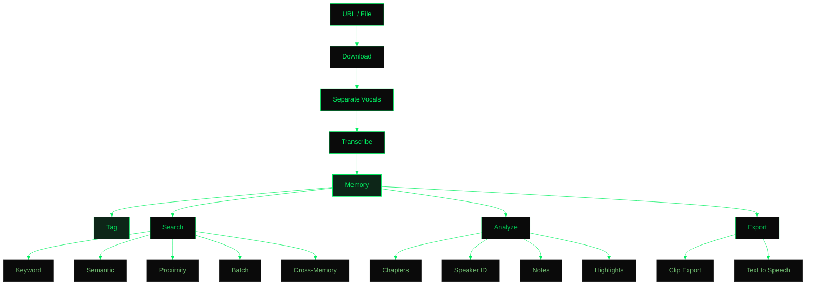

# Augent — The Audio Layer for Agents

<p align="center">
  <picture>
    
  </picture>
</p>

<p align="center">
  <strong>Any amount of content, seconds to find it. Fully local, fully private.</strong>
</p>

<p align="center">
  <a href="https://github.com/AugentDevs/Augent/actions/workflows/tests.yml"></a>
  
  <a href="https://www.python.org/downloads/"></a>
  <a href="https://discord.com/invite/DNmaZtaE7b"></a>
  <a href="https://opensource.org/licenses/MIT"></a>
</p>

<p align="center">
  <a href="#mcp-tools">MCP Tools</a> ·
  <a href="#cli">CLI</a> ·
  <a href="#web-ui">Web UI</a> ·
  <a href="https://augent.app">Website</a> ·
  <a href="https://docs.augent.app">Docs</a> ·
  <a href="https://docs.augent.app/tools/download-audio">Tool Reference</a> ·
  <a href="CHANGELOG.md">Changelog</a> ·
  <a href="https://discord.com/invite/DNmaZtaE7b">Discord</a> ·
  <a href="mailto:hello@augent.app">Contact</a>
</p>

**Augent** turns any audio or video source into structured, searchable intelligence for agents. Give it URLs or files. It downloads, transcribes, indexes, and stores everything in persistent memory. Search by keyword or meaning, find where concepts intersect, identify speakers, generate chapters and notes, batch process entire libraries, and more. One install, full pipeline, entirely on your machine.

If you want the quality info from content without sitting through it, the fastest way, this is it.

**Preferred setup:** run the one-line installer in your terminal. One command installs Augent, all dependencies, and the MCP server config. Works on macOS and Linux. Windows: install via pip. Works with Claude Code, Codex, and any MCP client. New install? Start here: [Getting started](https://docs.augent.app/getting-started).

<br />

## Install

```bash
curl -fsSL https://augent.app/install.sh | bash
```

Works on macOS and Linux. Installs everything automatically.

**Windows:** `pip install "augent[all] @ git+https://github.com/AugentDevs/Augent.git"`

<details>
<summary><strong>What does the installer do?</strong></summary>

<br />

The installer is a single bash script ([source](https://github.com/AugentDevs/Augent/blob/main/install.sh)). Every dependency is open source:

| Dependency | What it does |
|---|---|
| [Python](https://github.com/python/cpython) | Runtime |
| [FFmpeg](https://github.com/FFmpeg/FFmpeg) | Audio processing |
| [yt-dlp](https://github.com/yt-dlp/yt-dlp) | Media downloads |
| [aria2](https://github.com/aria2/aria2) | Parallel downloads |
| [espeak-ng](https://github.com/espeak-ng/espeak-ng) | TTS phonemizer |
| [faster-whisper](https://github.com/SYSTRAN/faster-whisper) | Speech-to-text |
| [PyTorch](https://github.com/pytorch/pytorch) | ML framework |
| [sentence-transformers](https://github.com/UKPLab/sentence-transformers) | Semantic search |
| [pyannote-audio](https://github.com/pyannote/pyannote-audio) | Speaker diarization |
| [Kokoro](https://github.com/hexgrad/kokoro) | Text-to-speech |
| [Demucs](https://github.com/adefossez/demucs) | Audio source separation |
| [FastAPI](https://github.com/fastapi/fastapi) | Local web UI |

No background services. No telemetry. No sudo on macOS.

| | |
|---|---|
| [**Full breakdown**](https://docs.augent.app/getting-started/installation) | What each phase installs and why |
| [**Manual install**](https://docs.augent.app/getting-started/installation#manual-install) | Step-by-step for macOS, Linux, and Windows |
| [**Uninstall**](https://docs.augent.app/getting-started/installation#uninstall) | How to fully remove Augent |

</details>

<br />

<p align="center">
  <picture>
    
  </picture>
</p>

<br />

## How It Works


```mermaid
graph TB
    A["URL / File"] --> B["Download"]
    B --> S["Separate Vocals"]
    S --> C["Transcribe"]
    C --> D["Memory"]
    D --> T["Tag"]

    D --> E["Search"]
    D --> F["Analyze"]
    D --> G["Export"]

    E --> E1["Keyword"]
    E --> E2["Semantic"]
    E --> E3["Proximity"]
    E --> E4["Batch"]
    E --> E5["Cross-Memory"]

    F --> F1["Chapters"]
    F --> F2["Speaker ID"]
    F --> F3["Notes"]
    F --> F4["Highlights"]

    G --> G1["Clip Export"]
    G --> G2["Text to Speech"]

    style A fill:#0a0a0a,stroke:#00f060,color:#00f060
    style B fill:#0a0a0a,stroke:#00f060,color:#00f060
    style S fill:#0a0a0a,stroke:#00f060,color:#00f060
    style C fill:#0a0a0a,stroke:#00f060,color:#00f060
    style D fill:#0d2618,stroke:#00f060,color:#00f060,stroke-width:2px
    style T fill:#0d2618,stroke:#00f060,color:#00f060

    style E fill:#0a0a0a,stroke:#00c050,color:#00c050
    style F fill:#0a0a0a,stroke:#00c050,color:#00c050
    style G fill:#0a0a0a,stroke:#00c050,color:#00c050

    style E1 fill:#0a0a0a,stroke:#1a1a1a,color:#6fba6f
    style E2 fill:#0a0a0a,stroke:#1a1a1a,color:#6fba6f
    style E3 fill:#0a0a0a,stroke:#1a1a1a,color:#6fba6f
    style E4 fill:#0a0a0a,stroke:#1a1a1a,color:#6fba6f
    style E5 fill:#0a0a0a,stroke:#1a1a1a,color:#6fba6f
    style F1 fill:#0a0a0a,stroke:#1a1a1a,color:#6fba6f
    style F2 fill:#0a0a0a,stroke:#1a1a1a,color:#6fba6f
    style F3 fill:#0a0a0a,stroke:#1a1a1a,color:#6fba6f
    style F4 fill:#0a0a0a,stroke:#1a1a1a,color:#6fba6f
    style G1 fill:#0a0a0a,stroke:#1a1a1a,color:#6fba6f
    style G2 fill:#0a0a0a,stroke:#1a1a1a,color:#6fba6f

    linkStyle default stroke:#00f060,stroke-width:1px
```

## Project Structure

```
augent/
├── mcp.py          # MCP server — tools for agents
├── core.py         # Transcription engine (faster-whisper)
├── search.py       # Keyword search
├── embeddings.py   # Semantic search + chapters
├── speakers.py     # Speaker diarization (pyannote-audio)
├── separator.py    # Audio source separation (Demucs v4)
├── tts.py          # Text-to-speech (Kokoro)
├── memory.py       # Three-layer memory (SQLite)
├── cli.py          # CLI interface
├── web.py          # Web UI (FastAPI)
├── export.py       # Export formats (JSON, CSV, SRT, VTT, MD)
└── clips.py        # Video clip export
```

<br />

## MCP Tools

The primary way to use Augent. Any MCP client gets direct access to all tools.

Add to `~/.claude.json` (global) or `.mcp.json` (project):

```json
{
  "mcpServers": {
    "augent": {
      "command": "augent-mcp"
    }
  }
}
```

Restart Claude Code. Run `/mcp` to verify connection.

| Tool | Description |
|:-----|:------------|
| [`download_audio`](https://docs.augent.app/tools/download-audio) | Download audio from video URLs at maximum speed (1,000+ supported sites) |
| [`transcribe_audio`](https://docs.augent.app/tools/transcribe-audio) | Full transcription with metadata |
| [`search_audio`](https://docs.augent.app/tools/search-audio) | Find keywords with timestamps and context snippets |
| [`deep_search`](https://docs.augent.app/tools/deep-search) | Search audio by meaning, not just keywords (semantic search) |
| [`take_notes`](https://docs.augent.app/tools/take-notes) | Take notes from any URL with style presets |
| [`chapters`](https://docs.augent.app/tools/chapters) | Auto-detect topic chapters in audio with timestamps |
| [`batch_search`](https://docs.augent.app/tools/batch-search) | Search multiple files in parallel, built for batch workflows and agent swarms |
| [`text_to_speech`](https://docs.augent.app/tools/text-to-speech) | Convert text to natural speech audio (Kokoro TTS, 54 voices, 9 languages) |
| [`search_proximity`](https://docs.augent.app/tools/search-proximity) | Find where keywords appear near each other |
| [`identify_speakers`](https://docs.augent.app/tools/identify-speakers) | Identify who speaks when in audio (speaker diarization) |
| [`separate_audio`](https://docs.augent.app/tools/separate-audio) | Isolate vocals from music and background noise (Demucs v4) |
| [`clip_export`](https://docs.augent.app/tools/clip-export) | Export a video clip from a URL for a specific time range |
| [`highlights`](https://docs.augent.app/tools/highlights) | Export MP4 clips of specific moments, auto-pick the best or target exactly what you want |
| [`tag`](https://docs.augent.app/tools/tag) | Add, remove, or list tags on transcriptions for organized filtering |
| [`search_memory`](https://docs.augent.app/tools/search-memory) | Search across ALL stored transcriptions by keyword or meaning |
| [`list_files`](https://docs.augent.app/tools/list-files) | List media files in a directory |
| [`list_memories`](https://docs.augent.app/tools/list-memories) | List stored transcriptions by title |
| [`memory_stats`](https://docs.augent.app/tools/memory-stats) | View transcription memory statistics |
| [`clear_memory`](https://docs.augent.app/tools/clear-memory) | Clear stored transcriptions |

**[Full tool reference →](https://docs.augent.app/tools/download-audio)**

<details>
<summary>Example prompt</summary>

> *"Download these 10 podcasts and find every moment a host covers a product in a positive or unique way. Not just brand mentions, only real endorsements or life-changing recommendations. Give me the timestamps and exactly what they said: url1, url2, url3, url4, url5, url6, url7, url8, url9, url10"*

<p align="center">
  <picture>
    
  </picture>
</p>

</details>

<br />

## CLI

Full CLI for terminal-based workflows. Works standalone or with any agent.

<picture>
  
</picture>

| Command | Description |
|:--------|:------------|
| `audio-downloader "URL"` | Download audio from video URL (speed-optimized) |
| `augent search audio.mp3 "keyword"` | Search for keywords |
| `augent transcribe audio.mp3` | Full transcription |
| `augent proximity audio.mp3 "A" "B"` | Find keyword A near keyword B |
| `augent memory search "query"` | Search across all stored transcriptions |
| `augent memory stats` | View memory statistics |
| `augent memory list` | List stored transcriptions |
| `augent memory clear` | Clear memory |

<br />

## Web UI

Local web interface. Runs 100% locally. No internet, no API keys, no data leaves your machine.

```bash
augent-web
```

Open: **http://127.0.0.1:8282**

**Search view:**
1. **Upload** an audio file or **paste a YouTube/video URL** to download audio directly
2. **Enter keywords** separated by commas
3. **Click SEARCH** and results stream live with timestamps and context
4. **YouTube timestamps** are automatically hyperlinked when the source is YouTube

**Clip export:**
- Click the **film icon** on any search result to create a visual region on the waveform, or **drag on the waveform** to select any range manually
- **Nudge buttons** (±1s / ±5s) on each edge for precise boundary adjustment
- **Preview** plays only the selected range so you hear exactly what will be exported
- **Export MP4** downloads only the selected segment — not the full video
- Keyboard shortcuts: `Space` preview, `Enter` export, `Esc` close

**Memory Explorer:**
- Browse **all** stored transcriptions, including files transcribed via MCP or CLI. Every tool writes to the same memory.
- View full transcripts with clickable YouTube timestamps
- **Delete** individual transcriptions from memory
- **Show Audio** to reveal the source audio file in Finder
- **Show Transcript** to reveal the `.md` transcript file in Finder. Drag it into a Claude Code session to run the full MCP pipeline on a previously transcribed file.
- **Share as HTML** to download a self-contained, shareable transcript page
- **Search across all memories** by keyword to find matches across every transcription in your library

**Source URL persistence:** When audio is downloaded from any URL — YouTube, Twitter/X, TikTok, Instagram, SoundCloud, and 1000+ sites — the source URL is permanently stored by file hash. Any future search or transcription of that file, even weeks later or from a different path, automatically links back to the original source. No need to re-enter the URL.

<details>
<summary>Web UI options</summary>

| Command | Description |
|:--------|:------------|
| `augent-web` | Start on port 8282 |
| `augent-web --port 8585` | Custom port |

</details>

<picture>
  
</picture>
<picture>
  
</picture>

<br />

## Multilingual

Augent transcribes audio in its **original language** with full accuracy — powered by OpenAI's Whisper, supporting **99 languages** including Chinese, French, Spanish, Japanese, Arabic, Hindi, Korean, German, Russian, Portuguese, and many more. Language is auto-detected, no configuration needed. Translation to English is handled by Claude (or your LLM), producing far better translations than any local model.

- When a transcription returns a non-English language, the MCP response includes a **translation offer**
- Accepting stores a clean English `(eng)` sibling file in memory alongside the original
- Both the original and translated versions appear in the Memory Explorer

<br />

## Model Sizes

**`tiny` is the default.** Handles everything from clean studio recordings to noisy field audio. Use `small` or above for heavy accents, poor audio, or lyrics.

| Model | Speed | Accuracy |
|:------|:------|:---------|
| **tiny** | Fastest | Excellent (default) |
| base | Fast | Excellent |
| small | Medium | Superior |
| medium | Slow | Outstanding |
| large | Slowest | Maximum |

<br />

## Contributing

PRs welcome. Open an [issue](https://github.com/AugentDevs/Augent/issues) for bugs or feature requests.

<br />

## License

MIT
